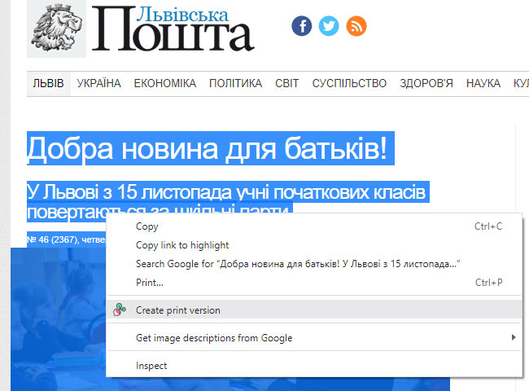
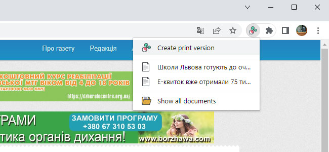
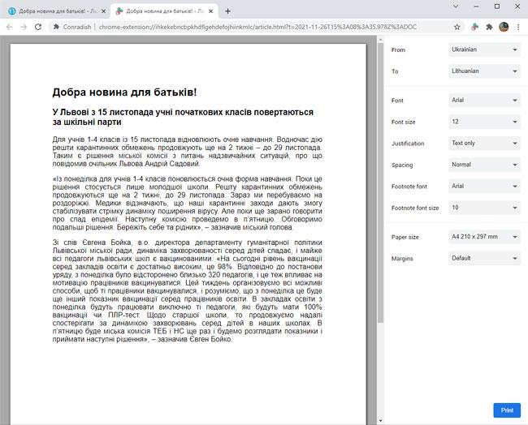
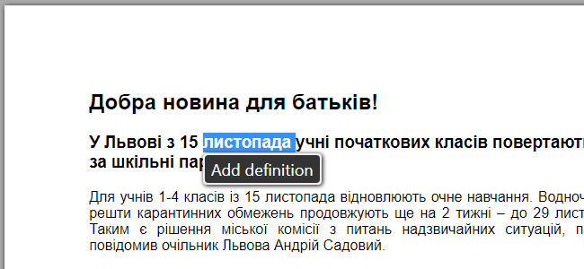
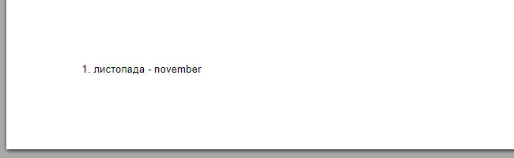
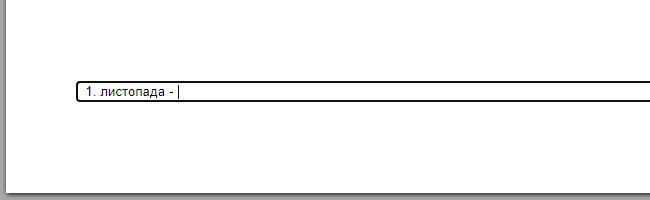
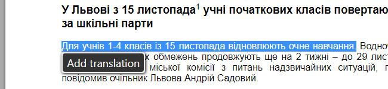
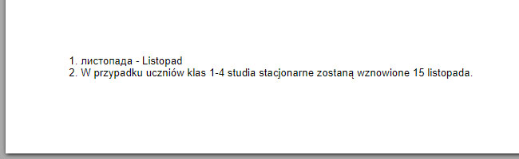

# Conradish

**Conradish** is blah blah blah

# Features

* [About](#conradish)
* [Features](#features)
* [User Guide](#user-guide)
  - [Creating print version of article](#creating-print-version-of-article)
  - [Annotating article](#annotating-article)
     - [Adding a definition](#adding-definition)
     - [Adding translation/explanation](#adding-translation-explanation)
     - [Removing footnotes](#removing-footnotes)
     - [Applying text style](#applying-text-style)
  - [Removing irrelevant contents](#removing-irrelevant-contents)
  - [Printing](#printing)
  - [Finding documents](#finding-documents)
* [Limitations](#limitations)
* [Privacy](#privacy)

# User Guide

## Creating print version of article

To create a print version of the article you're viewing, first select the portion that you wish to print. Then right click (or press the menu key on your keyboard) and choose "Create print version":

You can trigger the same action in the extension's menu, if you elect to not add an extra item to the browser's context menu:

The print version will open up in a new browser tab:

## Annotating article

### Adding definition

Select the term for which the definition is desired. A pop-up menu will appear underneath. Choose "Add definition":

If the "To" language specified in the side-bar differs from the "From" language, Conradish will look up the definition at Google Translate and insert it automatically as a footnote:

If the "To" language matches the "From" language or it is "None", then you'll need enter the definition yourself.

You can undo the operation by pressing Ctrl-Z on your keyboard.

### Adding translation/explanation

Select the sentence you wish translated. A pop-up menu will appear underneath. Choose "Add translation":

The translated sentence will then appear in the footer:

The "Add translation" function only differs from "Add definition" in that the original text is omitted from the footnote.

The "Add explanation" option will appear in the menu instead when the "To" language is the same as the "From" language or "None".

### Removing footnotes

### Applying text style

## Removing irrelevant contents

## Printing

# Limitations

# Privacy
