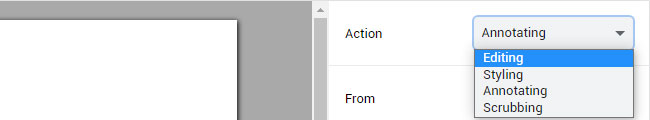
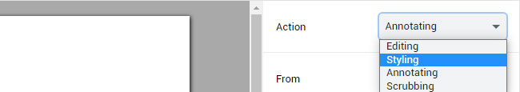
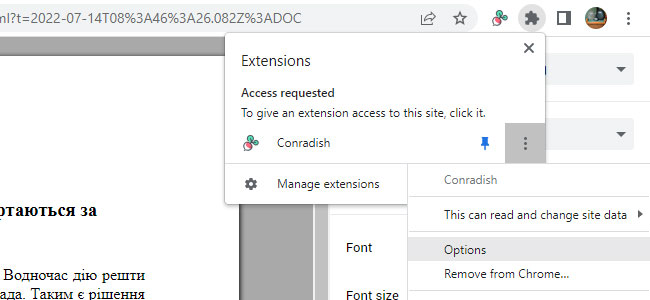
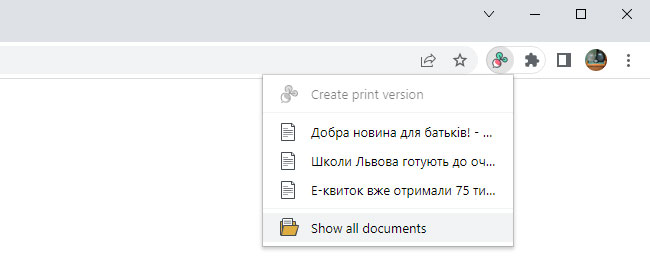

# Conradish

Conradish is a Chrome extension that lets you create print version of online news articles. It strips out ads and other distractions, reformatting text to a uniform, professional look. In addition, it lets you attach footnotes to words and sentences.

The extension was designed with educators in mind, those who wish to make use web materials in the classroom. It is especially useful for teachers of foreign languages thanks to its automatic translation feature.

* [Features](#features)
* [User Guide](#user-guide)
  - [Creating print version of article](#creating-print-version-of-article)
  - [Annotating article](#annotating-article)
     - [Adding definition](#adding-definition)
     - [Adding translation/explanation](#adding-translationexplanation)
     - [Removing footnotes](#removing-footnotes)
  - [Editing article](#editing-article)
  - [Applying text style](#applying-text-style)
  - [Finding missing text](#finding-missing-text)
  - [Adjusting filter behavior](#adjusting-filter-behavior)
  - [Printing](#printing)
  - [Finding documents](#finding-documents)
  - [Changing document title](#changing-document-title)
* [Limitations](#limitations)
* [Privacy](#privacy)
* [Support](#support)

# Features

* Printing only selected portion of an article
* Removal of ads and images
* Simplification of page layout
* Editing of text prior to printing
* Point-and-click content scrubbing.
* Addition of footnotes
* Integration with Google Translate

# User Guide

## Creating print version of article

To create a print version of the article that you're viewing, first select the portion you wish to print. Don't worry if the selection ends up including undesired navigational elements—these will get filtered out. After making the selection, right-click on it (or press the menu key on your keyboard) and choose **Create print version**:

You can trigger the same action in the extension's menu, if you elect to not add an extra item to the browser's context menu:

The print version will open up in a new browser tab:

## Annotating article

### Adding definition

Select the term for which the definition is desired. A pop-up menu will appear underneath. Choose **Add definition**:

If the **To** language specified in the side-bar differs from the **From** language, Conradish will look up the definition at Google Translate and insert it automatically as a footnote:

If the **To** language matches the **From** language or if "None" is selected, then you'll need to enter the definition yourself.

You can undo the action by pressing **Ctrl-Z** on your keyboard.

### Adding translation/explanation

Select the sentence you wish to be translated. A pop-up menu will appear underneath. Choose **Add translation**:

The translated sentence will then appear in the page's footer:

The **Add translation** functionality only differs from **Add definition** in that the original text is omitted in the footnote.

Both **Add definition** and **Add translation** will appear in the menu when more than one word (but less than 8) are selected.

**Add explanation** will appear in the menu instead when no translation would actually occur (the **To** language is the same as the **From** language or "None" is selected).

### Removing footnotes

To remove a footnote, simply delete the associated footnote number:

Or delete the footnote entry:

## Editing article

You can make changes to an article as you annotate it. The pop-up menu that appears whenever you select some text could be a distraction, however. To turn it off, choose "Editing" in the **Action** drop-down in the side-bar:

Click the **Finish** button to return to annotation mode.

## Applying text style

To apply text style to the document, choose "Styling" in the **Action** drop-down in the side-bar:

If you wish to change the size of a heading, place the text cursor inside it, then click one of the buttons in the tool-bar that appears below:

If you wish to bold or underline a word, select the word, then click the applicable button in the tool-bar that appears underneath:

You can also use the following hot-keys:

| Hot-key              | Text style        |
|----------------------|-------------------|
| **Ctrl-B**           | Bold              |
| **Ctrl-I**           | Italic            |
| **Ctrl-U**           | Underline         |
| **Alt-Shift-5**      | Strikethrough     |
| **Ctrl-Shift-Minus** | Subscript         |
| **Ctrl-Shift-Equal** | Superscript       |
| **Ctrl-\\**          | Clear formatting  |
| **Ctrl-1**           | Heading 1         |
| **Ctrl-2**           | Heading 2         |
| **Ctrl-3**           | Heading 3         |
| **Ctrl-4**           | Heading 4         |
| **Ctrl-5**           | Heading 5         |
| **Ctrl-6**           | Heading 6         |
| **Ctrl-0**           | Regular paragraph |

## Finding missing text

By default, Conradish will automatically filter out contents it deems irrelevant. Sometimes bylines and dates can be removed as a result. To see what got filtered out, choose "Scrubbing" in the **Action** drop-down in the side-bar.

Initial view:

With hidden contents shown:

Filtered contents will appear in red. Contents that Conradish thinks are questionable (but chose to keep) will pulsate in yellow. Click on a red section to restore it. Click on a section that isn't red to hide it. When you're done, click the **Finish** button or choose "Annotating" in the **Action** drop-down.

You can toggle between scrubbing and annotation mode by pressing the hot-key **Ctrl-Shift-H**.

Use the double checkmark button at the lower right-hand corner to restore all hidden sections:

## Adjusting filter behavior

Conradish's filter setting determines the initial mode when you open a document. When filtering is set to automatic, the editor starts in annotation mode, with suspected junks hidden. When filtering is set to manual, the editor starts in scrubbing mode, allowing you to immediately correct the extension's findings. When filtering is turned off, the editor starts in annotation mode, with suspected junks visible.

Depending on the web sites you visit, one of these settings will prove more convenient than the others. When a site provides a print stylesheet, filtering is generally not necessary. On the other hand, when a site intermingles a lot of ads and asides with the main article text, or the page layout leads to selection of navigational elements, then leaving it turned on is advisable.

To change the filter setting, click Chrome's extension button in the toolbar then the "kebab" button for Conradish. In the menu, choose **Options**:

Conradish's option pane will open up in a new tab:

## Printing

To print, click the **Print** button. Chrome's print window will appear. Double-check that **Paper size** matches what is set in Conradish and that **Margins** is set to "Default". The document will not print correctly if either one of these is off.

## Finding documents

To find a document you had created earlier, activate the extension's pop-up menu and choose **Show all documents**:

Documents are arranged by date. If you remember particular keywords, you can narrow the search by entering them into the search box.

## Changing document title

To change the title of a document, click on the "kebab" button beside the title and choose **Change title**:

If you're in the middle of annotating a document, right click on the page margin (or anywhere else outside the text) and choose **Change title**:

# Limitations

* Font selection has no impact on the display of East-Asian languages.
* User interface not yet optimized for touch screens.

These issues will be addressed in future versions.

# Privacy

Conradish does not capture any user information. It does not monitor your browsing history. All data is stored locally. The extension does send text to Google for the purpose of translation. The privacy implications are the same as those of using [Google Translate](https://policies.google.com/privacy). When you install the extension, the browser will warn that it can access "your data" at clients5.google.com. The data in question is just translated phrases.

# Support

If you have any questions or suggestions concerning this extension, feel free to contact me at chernyshevsky@hotmail.com.
