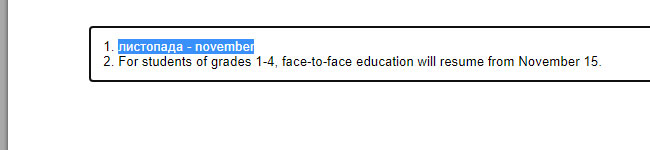
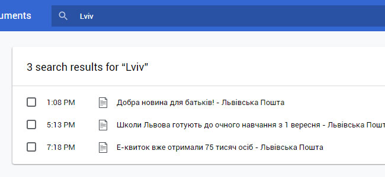

# Conradish

Conradish is a Chrome extension that lets you create print version of news articles with footnotes. It's designed for educators who wish to use online materials in the classroom. With its automatic translation feature, this extension is especially useful for teachers of foreign languages.

* [Features](#features)
* [User Guide](#user-guide)
  - [Creating print version of article](#creating-print-version-of-article)
  - [Annotating article](#annotating-article)
     - [Adding definition](#adding-definition)
     - [Adding translation/explanation](#adding-translationexplanation)
     - [Removing footnotes](#removing-footnotes)
  - [Applying text style](#applying-text-style)
  - [Finding missing text](#finding-missing-text)
  - [Removing irrelevant contents](#removing-irrelevant-contents)
  - [Printing](#printing)
  - [Finding documents](#finding-documents)
* [Limitations](#limitations)
* [Privacy](#privacy)

# Features

* Printing only selected portions of articles
* Removal of ads and images
* Simplification of page layout
* Editing of text before printing
* Point-and-click content scrubbing.
* Addition of footnotes
* Integration with Google Translate

# User Guide

## Creating print version of article

To create a print version of the article that you're viewing, first select the portion that you wish to print. Then right click (or press the menu key on your keyboard) and choose **Create print version**:

You can trigger the same action in the extension's menu, if you elect to not add an extra item to the browser's context menu:

The print version will open up in a new browser tab:

## Annotating article

### Adding definition

Select the term for which the definition is desired. A pop-up menu will appear underneath. Choose "Add definition":

If the **To** language specified in the side-bar differs from the **From** language, Conradish will look up the definition at Google Translate and insert it automatically as a footnote:

If the **To** language matches the **From** language or if "None" is selected, then you'll need to enter the definition yourself.

You can undo the result by pressing **Ctrl-Z** on your keyboard.

### Adding translation/explanation

Select the sentence you wish translated. A pop-up menu will appear underneath. Choose **Add translation**:

The translated sentence will then appear in the page's footer:

**Add translation** function only differs from **Add definition** in that the original text is omitted from the footnote.

**Add explanation** will appear in the menu instead when no translation would actually occur (the **To** language is the same as the **From** language or "None" is selected).

### Removing footnotes

To remove a footnote, simply delete the associated footnote number:

Or delete the footnote entry:

## Applying text style

The following hot-keys can be used to add basic text style:

| Hot-key              | Text style        |
|----------------------|-------------------|
| **Ctrl-B**           | Bold              |
| **Ctrl-I**           | Italic            |
| **Ctrl-U**           | Underline         |
| **Alt-Shift-5**      | Strikethrough     |
| **Ctrl-Shift-Minus** | Subscript         |
| **Ctrl-Shift-Equal** | Superscript       |
| **Ctrl-\\**          | Clear formatting  |
| **Ctrl-1**           | Heading 1         |
| **Ctrl-2**           | Heading 2         |
| **Ctrl-3**           | Heading 3         |
| **Ctrl-4**           | Heading 4         |
| **Ctrl-5**           | Heading 5         |
| **Ctrl-6**           | Heading 6         |
| **Ctrl-0**           | Regular text      |

## Finding missing text

By default, Conradish will automatically filter out contents it deems irrelevant. Sometimes bylines and dates can be removed as a result. Too see what got filtered out, select "Scrubbing" in the **Action** drop-down in the side-bar.

Initial view:

With hidden contents shown:

Filtered contents will appear in red. Contents that Conradish thinks are questionable (but chose to keep) will pulsate in yellow. Click on a section to restore it. When you're done, click the **Finish** button or select "Annotating" in the **Action** drop-down.

You can toggle between scrubbing and annotating mode by pressing the hot-key **Ctrl-Shift-H**.

## Removing irrelevant contents

## Printing

To print, click the **Print** button. Chrome's print window will appear. Double-check that **Paper size** matches what is set in Conradish and that **Margins** is set to "Default". The document will not print correctly if either one of these is off.

## Finding documents

To find a document you had created earlier, activate the extension's pop-up menu and choose **Show all documents**:

Documents are arranged by date. If you remember particular keywords, you can narrow the search by entering them into the search box.

# Limitations

* Font selection has no impact on the display of East-Asian languages.
* User interface not yet optimized for touch screens.

These issues will be addressed in future versions.

# Privacy

Conradish does not capture any user information. It does not monitor your browsing history. All data is stored locally. The extension does send text to Google for the purpose of translation. The privacy implications are the same as those of using [Google Translate](https://policies.google.com/privacy). When you install the extension, the browser will warn that it can access "your data" at clients5.google.com. The data in question is just the translated phrase.
